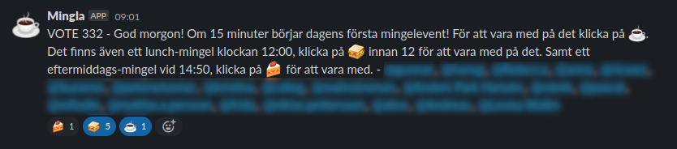
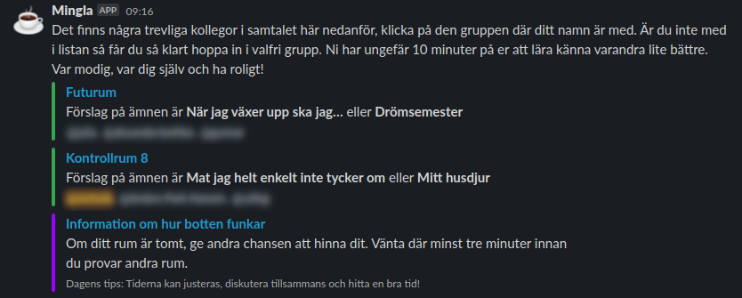

# Mingla

Mingla is an Slack bot used at SVT for (semi-)spontaneous video chats. We are a group of people that misses the spontaneous chats at the coffee machine, hallways, after meetings... we got inspired by [bump-into-colleagues](https://github.com/Familjen-Sthlm/bump-into-colleagues) and articles like [this article about weak tie friendships](https://www.bbc.com/worklife/article/20200701-why-your-weak-tie-friendships-may-mean-more-than-you-think).

We have been using the bot since the middle of November 2020, and we have has several fun and interesting conversations.

## Flow

The bot is executed four times a day. The first run will write a message to to a Slack channel we have chosen to call `#mingla-med-kollegor`. It contains some generic information, like the time slots when the mingle-events will happens. Currently it's hard coded to 09:15, 12:00 and 14:50.



> "Good morning! In 15 minutes with the first mingle event start!
> Click at :coffee: to be part of that. Choose :sandwich: to be part
> of the 12:00 event, and :cake: to be part of the 14:50 event."

We also ping everybody that's currently online (active) in the channel. We uses three different reactions, `:coffee:`, `:sandwich:` and `:cake:` to select the events you like to be part of. In the screenshot I have selected the 12:00 and 09:15 events.

It looks like it was a lazy (or maybe busy) morning and I was the only one that was interested to chat at 9. At 09:15 when the bot did it's second execution for the day, it looked at the `:coffee:` reaction and noticed that where was to few people to create rooms, so nothing will happen.

Yesterday the morning mingle was much more active. We had six people showing up (had selected "coffee"). This created two different groups.



> "Here are a few nice colleagues /../ select the group that you have been
> matched to. You are of course free to join any group if you was not selected. You have about 10 minutes to chat /.../"

We pick a few silly names for the groups matching real places at the office. We also suggests a few topics to kickstart the conversation.

The final two (lunch and afternoon) events has the exact same flow.

## Dependencies

Python 3.6+, a Slack team and social people.

## Installation

```
pip install git+https://github.com/svt/mingla.git@master
```

## Configuration

A sample configuration file is included here [config.sample.yml](config.sample.yml), edit it and rename it to `config.yml`.

## Usage

Just run `mingla` at 09:00, 09:15, 12:00 and 14:50!

## Getting involved

We love contributions, see [CONTRIBUTING](docs/CONTRIBUTING.md) for more information.

## License

This software is licensed under the MIT license, for more information see [LICENSE](LICENSE).

## Primary Maintainer

- [Stefan Berggren](https://github.com/nsg)

## Credits and references

1. [bump-into-colleagues](https://github.com/Familjen-Sthlm/bump-into-colleagues)
2. [Why your ‘weak-tie’ friendships may mean more than you think](https://www.bbc.com/worklife/article/20200701-why-your-weak-tie-friendships-may-mean-more-than-you-think)
